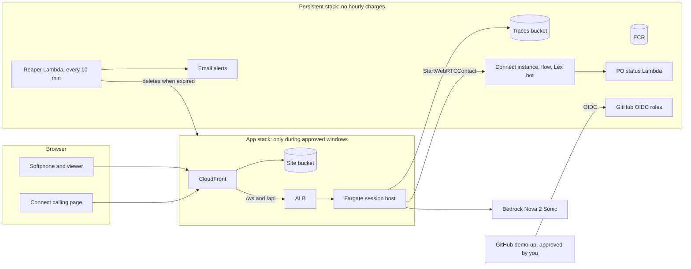
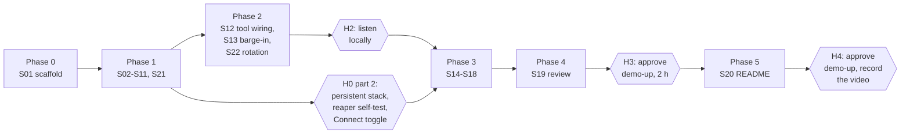

# Supplier Line — One-Shot Build Plan (v5)

Sep 26, 2026

## Summary

One orchestrator agent builds the whole app in a single pass on your notebook. It works through herdr, spawning one Claude Code agent per work stream, each in its own git worktree. The app runs on AWS: a Fargate session host behind an ALB and CloudFront, Nova 2 Sonic on Bedrock, and Amazon Connect as a second front door. The result is an English-only voice agent that answers purchase-order status, with its behaviour proven by traces. The headline is precise barge-in on the self-hosted path.

**The ALB and Fargate never run without your consent.** They exist only after you approve a deployment in GitHub, and an AWS-side reaper deletes them when the time you approved runs out, 8 hours at most. No agent, no push to `main`, and no scheduled job can create them.

The build stops only at five marked human checkpoints (H0–H4). Everything else runs unattended.

| Decision          | Choice                                                                                                                                                                                                                  |
| ----------------- | ----------------------------------------------------------------------------------------------------------------------------------------------------------------------------------------------------------------------- |
| Execution         | One shot: an Opus 5.5 orchestrator drives Claude Code agents through herdr on your notebook                                                                                                                             |
| Hosting           | AWS `us-east-1`: CloudFront, ALB, Fargate (ARM), S3, Lambda, Bedrock, Amazon Connect                                                                                                                                    |
| Infrastructure    | CDK in TypeScript: a persistent stack with no hourly charges, and an app stack (ALB, Fargate, CloudFront) that exists only during approved windows                                                                      |
| Consent           | The app stack deploys only through `demo-up`, a manual workflow gated by your approval in a GitHub Environment. You choose the window, 1 to 8 hours                                                                     |
| Enforcement       | An AWS Lambda reaper deletes the app stack when its window expires, when its expiry tag is missing, or 8 hours after creation, whichever comes first                                                                    |
| CI                | GitHub Actions runs lint, tests, CDK checks and trace checks on every push, with no AWS credentials at all                                                                                                              |
| Agent permissions | Agents get a Bedrock-and-Connect-calling AWS profile that explicitly denies ECS, load balancers, CloudFormation and IAM. The orchestrator's GitHub token can push code but can't start workflows or approve deployments |
| Language          | English (en-US) only                                                                                                                                                                                                    |
| Stack             | TypeScript, starting from AWS's `websocket-nodejs` Nova 2 Sonic sample; model `amazon.nova-2-sonic-v1:0`                                                                                                                |
| Build platform    | Your notebook is AMD64 and Fargate runs ARM64, so images are cross-built with Docker Buildx and QEMU, on the notebook and in CI alike                                                                                   |
| Quality gates     | pre-commit hooks: formatting, linting and secret scanning on every commit; typecheck, tests, CDK checks and trace checks before every push. CI runs the same hooks                                                      |
| Barge-in          | Model-detected only (V-03). The browser reports milliseconds played, so each turn shows planned, generated and heard                                                                                                    |
| Session length    | Up to 15 minutes. Sonic connections last at most 8 minutes, so session rotation (FH-05) is now in scope                                                                                                                 |
| Access control    | A demo access code checked by the session host; 15-minute session cap; at most 2 concurrent sessions                                                                                                                    |
| Models            | Haiku 4.5 for mechanical work, Sonnet 5 by default, Opus 5.5 for real-time audio, Connect infrastructure, the reaper, orchestration and review                                                                          |

## Consent controls

Five independent layers stop the ALB and Fargate from running without your say-so. Any one of them failing still leaves the others.

| Layer                   | What it prevents                                          | How                                                                                                                                                                                                                                  |
| ----------------------- | --------------------------------------------------------- | ------------------------------------------------------------------------------------------------------------------------------------------------------------------------------------------------------------------------------------ |
| 1. Approval gate        | Anyone or anything starting the app stack without you     | `demo-up` deploys into the GitHub Environment `demo`, which requires your approval. It's the only workflow whose AWS role can reach the app stack                                                                                    |
| 2. No automatic deploys | A push to `main` creating infrastructure                  | `ci.yml` has no AWS credentials. Nothing deploys on push                                                                                                                                                                             |
| 3. Agent limits         | An agent deploying, starting a workflow, or approving one | Agents' AWS profile explicitly denies ECS, Elastic Load Balancing, CloudFormation and IAM. The orchestrator's fine-grained GitHub token has no Actions-write or Deployments permission, so it can't dispatch `demo-up` or approve it |
| 4. Time limit           | An approved window running on after you forget it         | The reaper runs every 10 minutes and deletes the app stack past its `ExpiresAt` tag, or with no valid tag, or 8 hours after creation. It scales Fargate to zero first, so billing stops even if deletion is slow                     |
| 5. Visibility           | Anything happening without you knowing                    | Email alerts when the app stack is created or deleted, when a deletion fails, and when the reaper itself errors; AWS Budgets alerts at $10 and $30                                                                                   |

The worst case, if you approve a window and forget it, is 8 hours of running: roughly 60 cents.

## Architecture



- **CloudFront in front of everything.** It gives the browser HTTPS, which microphone access requires, on a free `cloudfront.net` domain, and it carries the WebSocket to the ALB. The ALB only accepts traffic from CloudFront.
- **Public subnets, no NAT gateway.** The Fargate task gets a public IP instead, which saves about $33 a month.
- **Access code instead of Cognito.** A code in SSM, checked on WebSocket connect, keeps strangers out without login redirects that break whenever the CloudFront domain changes. Each session is capped at 15 minutes, with at most 2 concurrent sessions.
- **Session rotation.** Nova 2 Sonic closes a connection after 8 minutes, so the host opens a fresh one in the background after 6 minutes and hands the conversation over (S22), following AWS's own session-continuation pattern.
- **Connect lives in the persistent stack.** It has no hourly charge, and the manual speech-to-speech setting survives every teardown.

## pre-commit hooks

`.pre-commit-config.yaml` defines every local quality gate once, and CI runs the same file, so a green notebook means a green CI.

| Stage  | Hook                                                                           | Runs on                                           |
| ------ | ------------------------------------------------------------------------------ | ------------------------------------------------- |
| Commit | Prettier (formats staged files)                                                | TypeScript, JSON, YAML, Markdown                  |
| Commit | ESLint with `--fix`                                                            | TypeScript                                        |
| Commit | Trailing whitespace, end-of-file, merge-conflict markers, YAML and JSON syntax | All files                                         |
| Commit | gitleaks (secret scanning)                                                     | All files; blocks committed keys and access codes |
| Commit | actionlint                                                                     | `.github/workflows/`                              |
| Push   | `pnpm typecheck`                                                               | Whole workspace                                   |
| Push   | `pnpm test`                                                                    | Whole workspace                                   |
| Push   | `pnpm cdk:check` (`cdk synth` plus `cdk-nag`)                                  | `infra/`                                          |
| Push   | `pnpm check:traces`                                                            | Committed traces                                  |

Git worktrees share the main checkout's hooks, so every agent's commits go through the commit stage automatically. Only the orchestrator pushes, so the push stage gates everything that reaches GitHub. Building the ARM image stays out of the hooks, because it's slow under QEMU; `ci.yml` does it instead.

## GitHub Actions workflows

| Workflow           | Trigger                                             | AWS access                                                              | What it does                                                                                                                                                                                                                                                                                                                                                                           |
| ------------------ | --------------------------------------------------- | ----------------------------------------------------------------------- | -------------------------------------------------------------------------------------------------------------------------------------------------------------------------------------------------------------------------------------------------------------------------------------------------------------------------------------------------------------------------------------- |
| `ci.yml`           | Every push and pull request                         | None                                                                    | Runs every pre-commit hook on all files, for both the commit and push stages; builds the `linux/arm64` image through QEMU without pushing, with layer caching                                                                                                                                                                                                                          |
| `demo-up.yml`      | Manual only, with an `hours` input (1–8, default 2) | Role trusted only for Environment `demo`, which requires your approval  | Builds the `linux/arm64` image with Buildx and QEMU and pushes it to ECR, deploys the app stack tagged with `ExpiresAt`, waits until healthy, then runs the live smoke job: replays the caller clips against the deployed URL, including a 7-minute scenario that crosses one session rotation, uploads traces, runs the five checks. Posts the URL and expiry time in the run summary |
| `demo-down.yml`    | Manual, and nightly as a backup to the reaper       | Role trusted only for Environment `teardown`, no approval needed        | Scales Fargate to zero, then destroys the app stack. Removing infrastructure never needs consent                                                                                                                                                                                                                                                                                       |
| `infra-deploy.yml` | Manual only                                         | Role trusted only for Environment `infra`, which requires your approval | Deploys changes to the persistent stack (Connect, Lambda, reaper). It can't create the app stack                                                                                                                                                                                                                                                                                       |

GitHub's scheduled workflows can run late, and are switched off after long inactivity, which is why the reaper runs in AWS rather than relying on the nightly job.

## Scope

**In**

- Session host, extended from the AWS Node sample and packaged as an ARM container
- Softphone and viewer served from S3 through CloudFront
- Playback ledger: the browser reports what it actually played
- One tool, `get_po_status`, used by the host directly and by Connect as a Lambda
- en-US spoken renderings for money, dates and PO codes
- Three failure behaviours: FH-01 (stream won't open), FH-03 (stall), FH-10 (tool timeout)
- Session rotation before Sonic's 8-minute connection limit (FH-05), so calls can last up to 15 minutes
- Traces written to S3, a viewer, and five trace checks run in GitHub Actions
- A caller-clip player for repeatable fixture sessions, locally and against the deployed app
- Connect: instance, Lex bot with Sonic speech-to-speech on en-US, a PO intent calling the Lambda, a flow with an error branch, and a browser-calling page
- The consent controls above: approval-gated workflows, the reaper, alerts and budgets
- CDK stacks with CDK assertion tests and `cdk-nag`
- pre-commit hooks mirrored in CI, and ARM64 cross-builds through QEMU

**Out: designed, not built (the README says so)**

- Portuguese and all language handling (L-01 to L-13)
- Client-detected barge-in (ADR-0003, V-08) and echo handling (FH-09)
- Stream reopen after a failure (FH-02)
- The Claude reasoning tool, supplier verification (SEC-01), and degradation modes beyond one fallback prompt
- Cognito sign-in, WAF, a custom domain, autoscaling, the full caller simulator, chaos tests, and a real phone number

## Before launch

**H0, part 1: one-time setup.** These steps need your credentials, so the orchestrator can't do them.

- [x] Install herdr (`curl -fsSL https://herdr.dev/install.sh | sh`, or `brew install herdr`) and check `herdr status` shows the server running
- [x] Install herdr's agent skill (`skills/herdr/SKILL.md` in the herdr repo) for the orchestrator
- [x] Install [Agent Skills](https://github.com/addyosmani/agent-skills) in Claude Code: `/plugin marketplace add addyosmani/agent-skills`, then `/plugin install agent-skills@addy-agent-skills`
- [x] Install QEMU emulation for ARM64 and a Buildx builder: `docker run --privileged --rm tonistiigi/binfmt --install arm64`, then `docker buildx create --name arm-builder --use`. Check that `docker buildx inspect --bootstrap` lists `linux/arm64`
- [x] Install pre-commit (`pipx install pre-commit`). S01 adds the config; the orchestrator runs `pre-commit install --hook-type pre-commit --hook-type pre-push` after merging it
- [x] Create the public GitHub repo, with `CLAUDE.md` holding the decisions table and out-of-scope list
- [x] Create GitHub Environments `demo` and `infra`, each with you as the required reviewer, and `teardown` with no reviewer
- [x] Create a fine-grained GitHub token for the orchestrator only: Contents and Pull requests read/write, Actions read, and nothing else. Set it as `GH_TOKEN` in the orchestrator's pane. Other agents get no GitHub token
- [x] Create the AWS profile `supplier-dev`: allow invoking Nova 2 Sonic, `connect:StartWebRTCContact`, reading the traces bucket and CloudWatch logs; explicitly deny `ecs:*`, `elasticloadbalancing:*`, `cloudformation:*`, `iam:*` and `ec2:RunInstances`. Agents use only this profile
- [x] Run `cdk bootstrap` in `us-east-1` with your admin profile
- [x] Add the repo secret `DEMO_ACCESS_CODE`

**H1: record five caller clips** with your headset mic, as 16 kHz mono WAV: a PO-status question, the same question with a different PO, an interruption ("wait, stop"), a follow-up ("and the delivery date?"), and 3 seconds of silence. Save them under `fixtures/clips/`.

**H0, part 2: after Phase 1** (the orchestrator stops and asks):

- [ ] Deploy the persistent stack once from your notebook with admin credentials. This creates the GitHub roles, the reaper, alerts, budgets and Connect
- [ ] Confirm the alert email subscription
- [ ] Add the three role ARNs as repo variables
- [ ] Run the reaper self-test: `pnpm reaper:selftest` deploys a tiny tagged test stack with a 5-minute expiry. Confirm you get the created email, then the deleted email within 15 minutes
- [ ] In the Connect admin website, confirm Amazon Connect Customer is enabled for the instance, set the bot's en-US locale to Speech-to-Speech with Amazon Nova Sonic, build it, and set the flow's voice to Matthew (Generative)

The Connect speech-model setting is manual because configuring it through an API or CloudFormation is unverified (V-09).

## Execution with herdr

The orchestrator is a Claude Code agent on Opus 5.5 in the first herdr pane. It never writes feature code. It creates worktrees, spawns agents, prompts them, waits, reviews, merges and pushes.

For each work stream it follows the same loop:

```bash
# 1. Isolated checkout per stream
git worktree add ../supplier-line-s02 -b s02

# 2. A sibling pane in that checkout, without stealing your focus
herdr pane split --current --direction right --cwd ../supplier-line-s02 --no-focus

# 3. Start Claude Code on the stream's model (confirm the kind name with `herdr agent`)
herdr agent start s02 --kind claude --pane <pane-id-from-json> -- --model claude-sonnet-5

# 4. Hand over the brief and wait until the agent settles
herdr agent prompt s02 "<stream brief from the table below>" --wait --timeout 1800000

# 5. Read the outcome
herdr agent read s02 --source recent-unwrapped --lines 120
```

Then it checks the stream's done criteria by running the tests itself, merges into `main` in table order, removes the worktree, pushes, and follows `ci.yml` with `gh run watch`.

Six rules keep the run safe:

- **At most four agents at once.** It keeps the notebook responsive and stays within model rate limits.
- **Parse, don't guess.** herdr returns JSON; pane IDs come from `.result.pane.pane_id`.
- **Blocked means ask.** If an agent shows `blocked`, the orchestrator reads its screen and waits for you. It never answers approval prompts on your behalf.
- **Infrastructure is yours.** No agent runs `cdk deploy` or `cdk destroy`, starts a workflow, or approves a deployment. The permissions above enforce this; the rule makes the intent explicit.
- **Never skip hooks.** No agent or orchestrator uses `--no-verify` on a commit or a push. A failing hook is a failing stream.
- **Escalate once.** If a Sonnet 5 stream misses its done criteria twice, the orchestrator reruns it on Opus 5.5. If that also fails, it stops and reports.

## Dependency graph



S12, S13 and S22 run one after the other, not in parallel, because all three change the host's stream handling. Everything before H3 runs on your notebook against real Bedrock and Connect, with no ALB or Fargate.

## Work streams and models

| ID   | Phase | Stream                       | Output                                                                                                                                                                                                                                                                                                                                                                                                                                       | Done when                                                                                                                                | Skill                                     | Model     |
| ---- | ----- | ---------------------------- | -------------------------------------------------------------------------------------------------------------------------------------------------------------------------------------------------------------------------------------------------------------------------------------------------------------------------------------------------------------------------------------------------------------------------------------------- | ---------------------------------------------------------------------------------------------------------------------------------------- | ----------------------------------------- | --------- |
| ORCH | All   | Orchestrator                 | Worktrees, prompts, merges, pushes, CI watching                                                                                                                                                                                                                                                                                                                                                                                              | Every phase merged; CI green                                                                                                             | herdr skill                               | Opus 5.5  |
| S01  | 0     | Scaffold                     | pnpm workspace: `host`, `web`, `tools`, `traces`, `infra`, `scripts`; strict TypeScript, Vitest, ESLint, Prettier; `.pre-commit-config.yaml` with the hooks above; placeholder scripts for `typecheck`, `cdk:check` and `check:traces`                                                                                                                                                                                                       | `pre-commit run --all-files --hook-stage pre-commit` and `--hook-stage pre-push` both pass                                               | None                                      | Haiku 4.5 |
| S02  | 1     | Data generator               | Deterministic suppliers and POs, with a check digit on every PO                                                                                                                                                                                                                                                                                                                                                                              | Golden tests pass; any single wrong digit fails                                                                                          | `test-driven-development`                 | Sonnet 5  |
| S03  | 1     | en-US renderings             | Money from integer cents plus ISO code; spoken dates; PO codes read digit by digit                                                                                                                                                                                                                                                                                                                                                           | Golden files pass                                                                                                                        | `test-driven-development`                 | Sonnet 5  |
| S04  | 1     | `get_po_status` handler      | Pure handler plus two adapters (Sonic tool use, Lambda); Zod schema, reason codes, delay-injection hook                                                                                                                                                                                                                                                                                                                                      | Returns a structured value and its spoken rendering                                                                                      | `test-driven-development`                 | Sonnet 5  |
| S05  | 1     | Trace schema and writer      | Trace-contract subset incl. `front_door`, latency, barge-in timing, `fh.id`; writes to a local folder or S3                                                                                                                                                                                                                                                                                                                                  | Schema tests pass for both targets                                                                                                       | `test-driven-development`                 | Sonnet 5  |
| S06  | 1     | Trace checks                 | `pnpm check:traces` running the five checks                                                                                                                                                                                                                                                                                                                                                                                                  | Passes on good sample traces, fails on broken ones                                                                                       | `test-driven-development`                 | Sonnet 5  |
| S07  | 1     | Viewer                       | Static page: per-turn timeline with planned, generated and heard, plus barge-in and failure markers; reads local files or the host's `/api/traces`                                                                                                                                                                                                                                                                                           | Renders the sample traces                                                                                                                | None                                      | Sonnet 5  |
| S08  | 1     | Container                    | Multi-stage Dockerfile: install and compile on the build machine's own platform (`FROM --platform=$BUILDPLATFORM`), then copy the output into a `linux/arm64` Node LTS runtime image, so almost nothing runs under emulation; no native add-ons; health check endpoint                                                                                                                                                                       | `docker buildx build --platform linux/arm64 --load` succeeds on the AMD64 notebook, and the container passes its health check under QEMU | None                                      | Sonnet 5  |
| S09  | 1     | CDK app stack                | VPC with public subnets only; ECS cluster and Fargate ARM service (0.5 vCPU, 1 GB); ALB reachable only from CloudFront, 300 s idle timeout; CloudFront with S3 site and `/ws` and `/api` routes; required `ExpiresAt` and `supplier-line:ephemeral` tags, and synth fails without them                                                                                                                                                       | Assertion tests and `cdk-nag` pass                                                                                                       | `test-driven-development`                 | Sonnet 5  |
| S10  | 1     | CDK persistent stack         | ECR; traces bucket; SSM access code; PO Lambda (from S04); Connect instance, contact flow with error branch, Lex bot with PO intent and digit slot; GitHub OIDC provider and three roles, each trusted only for its Environment; Budgets alerts at $10 and $30                                                                                                                                                                               | Assertion tests and `cdk-nag` pass; no role trusts a branch, only Environments                                                           | `code-review-and-quality`                 | Opus 5.5  |
| S11  | 1     | GitHub Actions               | The four workflows in the table above; `demo-up` includes the live smoke job                                                                                                                                                                                                                                                                                                                                                                 | Workflows pass `actionlint`; `ci.yml` green on a branch; tests confirm no workflow other than `demo-up` references the `demo` role       | None                                      | Sonnet 5  |
| S21  | 1     | Reaper and alerts            | Lambda on a 10-minute EventBridge schedule: finds app stacks by tag, scales ECS to zero, then deletes any past `ExpiresAt`, missing or malformed tags, or older than 8 hours; email alerts on stack created, deleted, delete failed, and reaper errors; `pnpm reaper:selftest`                                                                                                                                                               | Unit tests with mocked AWS clients cover every deletion rule and the error alarm                                                         | `test-driven-development`                 | Opus 5.5  |
| S12  | 2     | Tool wiring                  | Tool registered with Sonic; system prompt says to speak renderings exactly; trace writer hooked in                                                                                                                                                                                                                                                                                                                                           | A replayed PO clip gets a correct spoken answer locally                                                                                  | None                                      | Opus 5.5  |
| S13  | 2     | Barge-in and playback ledger | Worklet reports milliseconds played; host records planned, generated and heard; flush on `INTERRUPTED`                                                                                                                                                                                                                                                                                                                                       | The interruption clip produces all three columns                                                                                         | None (by ear)                             | Opus 5.5  |
| S22  | 2     | Session rotation (FH-05)     | TypeScript port of AWS's Python session-continuation pattern: after a configurable threshold (6 minutes live, 60 seconds in tests) and once the agent starts speaking, open the next connection in the background, buffer the last 3 seconds of caller audio, replay the conversation using the **heard** text from the ledger rather than the generated text, hand over, close the old connection; trace event `FH-05` with the handoff gap | With a 60 s threshold, a 3-minute clip session rotates twice with no caller audio lost; stops at H2                                      | `test-driven-development` (state machine) | Opus 5.5  |
| S14  | 3     | Failure behaviours           | FH-01 fallback prompt; FH-03 filler at 1.5 s; FH-10 filler, one retry, stale result discarded; each behind a fault flag                                                                                                                                                                                                                                                                                                                      | Each is reproducible by flag and visible in the trace                                                                                    | `test-driven-development` (fake timers)   | Sonnet 5  |
| S15  | 3     | Phrase capture               | Script asking Sonic to say each fixed phrase; saves 2–3 variants                                                                                                                                                                                                                                                                                                                                                                             | Audio files committed under `assets/`                                                                                                    | None                                      | Haiku 4.5 |
| S16  | 3     | Caller-clip player           | Streams H1's clips in real time to a local or deployed host, starting the interruption clip a set delay after agent audio begins; a long scenario that repeats turns with pauses for a set duration                                                                                                                                                                                                                                          | Five short scenarios and the long one run unattended against the local host and write traces                                             | None                                      | Sonnet 5  |
| S17  | 3     | Access control and limits    | Access code checked on WebSocket connect; 15-minute session cap with a spoken one-minute warning; 2 concurrent sessions; WebSocket keepalive every 20 s; `/api/connect/start` calling `StartWebRTCContact`                                                                                                                                                                                                                                   | Tests cover wrong code, cap reached and expiry                                                                                           | `test-driven-development`                 | Sonnet 5  |
| S18  | 3     | Connect calling page         | Page using the Amazon Chime SDK to join the call returned by `/api/connect/start`                                                                                                                                                                                                                                                                                                                                                            | A call from the locally running host gets a correct PO answer; the error branch plays its message                                        | None                                      | Sonnet 5  |
| S19  | 4     | Final review                 | Review across security, IAM least privilege, the consent controls, correctness and readability                                                                                                                                                                                                                                                                                                                                               | Blocking findings fixed; `cdk-nag` clean                                                                                                 | `code-review-and-quality`                 | Opus 5.5  |
| S20  | 5     | README and ADRs              | Architecture, consent controls, built-versus-designed lists, cost notes, and short ADRs (English-only, model-detected barge-in, two stacks, consent-gated deploys, access code over Cognito)                                                                                                                                                                                                                                                 | Every claim matches code, a workflow run, or a committed trace                                                                           | `code-review-and-quality`                 | Sonnet 5  |

**At H3,** you approve `demo-up` for 2 hours. Its live smoke job replays the clip scenarios against the deployed app and runs the five checks. The orchestrator then commits those traces as fixtures, so `ci.yml` checks real deployed behaviour from then on. The reaper removes the app stack when the window ends.

## Model policy

Sonnet 5 is the default. Haiku 4.5 takes work where the shape is fixed and mistakes show up immediately. Opus 5.5 is reserved for the orchestrator, the three real-time audio streams, the Connect and IAM infrastructure, the reaper that enforces your consent, and the final review.

| Model            | Model ID                    | Price per 1M tokens, in / out | Used for                           |
| ---------------- | --------------------------- | ----------------------------- | ---------------------------------- |
| Claude Haiku 4.5 | `claude-haiku-4-5-20251001` | $1 / $5                       | S01, S15                           |
| Claude Sonnet 5  | `claude-sonnet-5`           | $2 / $10                      | S02–S09, S11, S14, S16–S18, S20    |
| Claude Opus 5.5  | `claude-opus-5-5`           | $4 / $20                      | ORCH, S10, S12, S13, S19, S21, S22 |
| Claude Fable 5.1 | `claude-fable-5-1`          | $10 / $50                     | Not used; nothing here needs it    |

Opus 5.5 costs only twice Sonnet 5, so escalating a failing stream is cheap compared with a broken demo.

## Human checkpoints

| ID  | When                              | What you do                                                                                                                                                                                     | Orchestrator waits for                                 |
| --- | --------------------------------- | ----------------------------------------------------------------------------------------------------------------------------------------------------------------------------------------------- | ------------------------------------------------------ |
| H0  | Before launch, then after Phase 1 | One-time setup; deploy the persistent stack; pass the reaper self-test; set up Connect speech-to-speech                                                                                         | The role ARNs as repo variables, and your confirmation |
| H1  | Before launch                     | Record the five caller clips                                                                                                                                                                    | Files in `fixtures/clips/`                             |
| H2  | After S22                         | Talk to the local softphone with headphones; interrupt it twice; keep talking past a rotation (threshold set to 60 s for this check) and listen for a gap; approve or describe what feels wrong | Your reply in the orchestrator pane                    |
| H3  | After S19                         | Start `demo-up` for 2 hours and approve it                                                                                                                                                      | The run's live smoke result                            |
| H4  | After S20                         | Start and approve `demo-up`, record the video; the reaper removes the stack at expiry, or run `demo-down` sooner                                                                                | Nothing; the build is complete                         |

## AWS cost

Approximate, in US dollars, for `us-east-1`.

| Item                                                                        | When it's charged            | Cost                                                                              |
| --------------------------------------------------------------------------- | ---------------------------- | --------------------------------------------------------------------------------- |
| App stack (ALB, Fargate ARM 0.5 vCPU and 1 GB, 3 public IPs, CloudFront)    | Only during approved windows | About 7 cents an hour                                                             |
| Persistent stack (ECR, S3, Lambdas, reaper schedule, SSM, Connect instance) | Always                       | About $1–3 a month, mostly storage                                                |
| Nova 2 Sonic                                                                | Per conversation minute      | Roughly 1.5 cents a minute                                                        |
| Connect browser call                                                        | Per minute                   | $0.048 ($0.038 voice service, which includes Nova Sonic, plus $0.010 web calling) |

Two 2-hour windows (H3 and H4) cost about 30 cents in infrastructure. With 15-minute sessions and 2 concurrent callers, the most Sonic can cost is about 45 cents per hour of continuous use. The whole build should land at a few dollars, mostly Bedrock minutes during development. GitHub Actions is free for a public repo.

## Acceptance

The build is done when `ci.yml` is green on `main`, the pre-commit hooks pass on all files, the live smoke job in `demo-up` passes including the rotation scenario, the reaper self-test has passed, the README separates built from designed, and the video is recorded.

| Check                         | Rule, per turn                                                                                       | Trace fields                                                             |
| ----------------------------- | ---------------------------------------------------------------------------------------------------- | ------------------------------------------------------------------------ |
| Heard never exceeds generated | Audio played is at most audio delivered                                                              | `audio.played_ms`, `audio.delivered_ms`                                  |
| Fast flush                    | After a barge-in, playback stops within 300 ms (initial target, from M-01)                           | `bargein.at_ms`, `audio.flush_latency_ms`                                |
| Exact renderings              | Where a tool returned a value and no barge-in cut the answer, the spoken text contains its rendering | `assistant.final_text`, tool rendering                                   |
| No dead air                   | After the caller stops speaking, agent audio or a filler starts within 2.5 s                         | `latency.voice_to_voice_ms`, `filler.played`                             |
| Rotation loses nothing        | Across every `FH-05` handoff, caller audio received equals caller audio forwarded to Sonic           | `rotation.audio_in_ms`, `rotation.audio_forwarded_ms`, `rotation.gap_ms` |

The check script, now with five checks, must also fail on hand-edited broken traces, so a check that always passes can't slip through.

## Demo video

Aim for about three minutes, with every claim shown next to its trace.

1. What it is: one sentence and the architecture diagram (20 s)
2. Happy path on the deployed softphone, then its trace (30 s)
3. Barge-in mid-answer; pause on the trace to show planned, generated, heard and the flush time (45 s)
4. Tool timeout: the filler, the retry, and the FH-10 marker (20 s)
5. Stream-open failure: the captured fallback phrase in the same voice, and the FH-01 marker (15 s)
6. The same PO question through Connect in the browser, noting which fields Connect doesn't expose (30 s)
7. The `demo-up` run: your approval, the deploy, the live smoke checks, and the expiry time (20 s)

## Risks and fallbacks

| Risk                                                                      | Early signal                                                            | Fallback                                                                                                                                        |
| ------------------------------------------------------------------------- | ----------------------------------------------------------------------- | ----------------------------------------------------------------------------------------------------------------------------------------------- |
| The reaper fails silently                                                 | Reaper error alarm; no deleted email after a window                     | Error alarm emails you; `demo-down` runs nightly as a backup; run it manually                                                                   |
| Stack deletion hangs                                                      | Delete-failed email                                                     | Fargate is already scaled to zero, so compute billing has stopped; fix the blocking resource and rerun `demo-down`                              |
| An agent tries to deploy or start a workflow                              | Access-denied errors in its pane                                        | Expected; the orchestrator reports it and carries on                                                                                            |
| ARM builds are slow or crash under QEMU                                   | `ci.yml` image step over 15 minutes, or segfaults during `pnpm install` | Keep install and compile on the native stage (S08); if it still fails, switch the task to x86 Fargate, about a cent an hour more, and drop QEMU |
| A rotation is audible, or the agent repeats itself after handoff          | Rotation-loses-nothing check fails, or you hear it at H2                | Tune the handoff to wait for a pause in speech; if still rough, set the session cap to 7.5 minutes by config and list rotation as designed      |
| Hooks make commits too slow for agents                                    | Agents spend minutes per commit                                         | Keep only formatting, linting and gitleaks at commit time; everything else already runs at push time                                            |
| Parallel agents conflict on shared files                                  | Merge conflicts in Phase 1                                              | S01 creates every package up front; the orchestrator merges in table order and resolves lockfile conflicts itself                               |
| WebSocket drops through CloudFront or the ALB                             | Sessions die during silence                                             | Keepalive every 20 s (S17); ALB idle timeout 300 s                                                                                              |
| Latency through CloudFront hurts barge-in                                 | Fast-flush check fails only when deployed                               | Compare local and deployed traces; report both numbers honestly in the README                                                                   |
| The CDK-created Lex bot doesn't appear as a Connect conversational AI bot | Missing at H0 part 2                                                    | Create the bot in the Connect admin website and pass its ID to the persistent stack as a parameter                                              |
| Speech-to-speech missing on Connect in `us-east-1`                        | Absent at H0 part 2                                                     | Move the persistent stack's Connect resources to `us-west-2`                                                                                    |
| Someone finds the demo URL during a window                                | Budget alert                                                            | Rotate the access code in SSM; run `demo-down`                                                                                                  |

## Findings for the full plan

Seven findings came out of review, in the review draft's own format.

| ID                  | Severity | Finding                                                                                                                                    | Proposed fix                                                                                                                 |
| ------------------- | -------- | ------------------------------------------------------------------------------------------------------------------------------------------ | ---------------------------------------------------------------------------------------------------------------------------- |
| V-06                | Minor    | AWS's Node sample already uses the JavaScript SDK v3 with `amazon.nova-2-sonic-v1:0`                                                       | Mark verified once the sample runs in your account; D1 stands                                                                |
| Architecture, PR-12 | Major    | Connect keeps orchestration, intents and flows when Sonic is the speech model, so its bot doesn't call tools the way the session host does | Show the Connect bot reaching tools through intents and a Lambda; add a verification item                                    |
| V-10                | Major    | Connect's documented Nova Sonic voices are Matthew (en-US), Amy (en-GB), Olivia (en-AU) and Lupe (es-US); none is Portuguese               | Plan for English-only Connect unless a newer check finds a pt-BR voice                                                       |
| L-02                | Major    | Switching language mid-call probably needs a new Sonic session, since the system prompt is set at session start                            | Tie L-02 to the FH-05 rotation work; add a verification item                                                                 |
| FH-07, FH-08        | Major    | Both rely on injecting instructions mid-session; that behaviour isn't on the verification list                                             | Add a verification item for mid-session text input                                                                           |
| Handoff (non-goals) | Major    | No mechanism is given for a self-hosted browser session to reach a Connect queue                                                           | Use browser calling (`StartWebRTCContact`) as the bridge, as S17 already does for the demo, or scope handoff to Connect only |
| L-13                | Minor    | No scenario covers L-13, so the PR-03 coverage check fails as written                                                                      | Exempt L-13 explicitly, or add a meta-scenario                                                                               |

Using Matthew on the self-hosted path too keeps the agent's voice identical across both front doors.

## Launch prompt for the orchestrator

Paste this into the first herdr pane, running Claude Code with `--model claude-opus-5-5`:

> You are the orchestrator for this repo. Read `CLAUDE.md` and `docs/build-plan.md` (this file). Confirm `HERDR_ENV=1`, then execute the dependency graph phase by phase, with at most four agents running at once. For each work stream: create a git worktree and branch named after it, split a sibling pane in that worktree with `--no-focus`, start Claude Code on the model in the table, and prompt it with the stream's output, done criteria and skill. Wait with `herdr agent prompt --wait`, read the result, verify the done criteria yourself by running the tests, then merge in table order, push, and follow `ci.yml` with `gh run watch`. Escalate a stream to Opus 5.5 after two misses; stop and report after a third. Stop at H0 part 2, H2, H3 and H4 and wait for me. Never write feature code, never run `cdk deploy` or `cdk destroy`, never start a workflow or approve a deployment, never use `--no-verify`, never answer an agent's approval prompt, and never close panes you didn't create. At H3, once I report the live smoke result, commit its traces as fixtures and continue.

## Sources

- [herdr](https://github.com/herdrdev/herdr), including its agent skill at `skills/herdr/SKILL.md`
- [Agent Skills](https://github.com/addyosmani/agent-skills), Addy Osmani
- [amazon-nova-samples](https://github.com/aws-samples/amazon-nova-samples), AWS
- [Configure Amazon Nova Sonic Speech-to-Speech](https://docs.aws.amazon.com/connect/latest/adminguide/nova-sonic-speech-to-speech.html), Amazon Connect admin guide
- [Integrate in-app, web and video calling](https://docs.aws.amazon.com/connect/latest/adminguide/config-com-widget2.html), Amazon Connect admin guide
- [Speech-to-Speech (Amazon Nova 2 Sonic)](https://docs.aws.amazon.com/nova/latest/nova2-userguide/using-conversational-speech.html), Amazon Nova user guide: the 8-minute connection limit
- Session continuation pattern: `speech-to-speech/amazon-nova-2-sonic/repeatable-patterns/session-continuation/` in amazon-nova-samples
- [AWS Fargate pricing](https://aws.amazon.com/fargate/pricing/)
- [Amazon Connect Customer pricing appendix](https://aws.amazon.com/products/connect/customer/pricing/appendix/)
- Nova 2 Sonic and Claude model prices: third-party summaries of published rates, checked Sep 25–26, 2026; confirm on the Bedrock and Anthropic pricing pages
